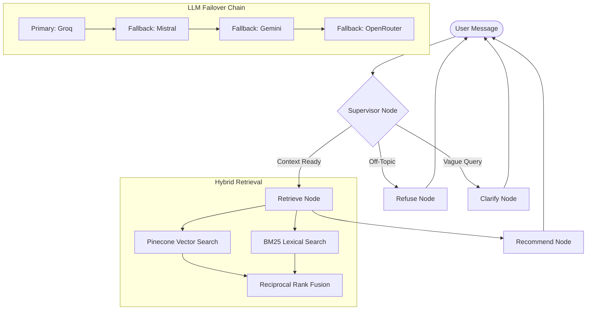

# SHL Assessment Recommender Agent 🚀

[](https://shl-assessment-recommender-kxsu.onrender.com)
[](https://www.python.org/downloads/)
[](https://github.com/langchain-ai/langgraph)

An advanced, production-grade conversational AI agent designed to act as a **Professional SHL Consultant**. The system analyzes job descriptions, seniorities, and required skills to recommend a tailored battery of SHL assessments using a sophisticated tiered-LLM architecture and hybrid retrieval.

**Live Demo:** [https://shl-assessment-recommender-kxsu.onrender.com](https://shl-assessment-recommender-kxsu.onrender.com)

---

## ✨ Key Features

- **🛡️ Tiered-LLM Architecture**: Optimized for both performance and cost.
  - **Supervisor/Analysis**: Llama 3.3 70B (Groq) for high-precision extraction.
  - **Clarification/Refusal**: Llama 3.1 8B (Groq) for near-instant responses.
- **⚡ Instant Failover Engine**: Zero-retry fallback chain across **Groq, Mistral AI, Google Gemini, and OpenRouter** to ensure 100% uptime despite free-tier rate limits.
- **🔍 Hybrid Retrieval System**: Combines **Pinecone (Dense Vector)** and **BM25 (Lexical)** search for maximum Recall@10 metrics.
- **🧠 Expert Consultation Persona**: Implements few-shot prompting and consultative guidelines to handle missing data (e.g., suggesting proxies for missing tests like Terraform) and avoiding hallucinated URLs.
- **🔒 Production Ready**: Fully Dockerized, Pydantic-backed structured outputs, and integrated LangSmith tracing.

---

## 🏗️ Architecture



---

## 🛠️ Tech Stack

- **Framework**: [FastAPI](https://fastapi.tiangolo.com/), [LangGraph](https://langchain-ai.github.io/langgraph/)
- **LLMs**: Llama 3.3 70B, Llama 3.1 8B, Mistral Small
- **Vector DB**: [Pinecone](https://www.pinecone.io/)
- **Embeddings**: HuggingFace (`all-MiniLM-L6-v2`)
- **Package Manager**: [uv](https://github.com/astral-sh/uv)
- **Deployment**: [Render](https://render.com/), Docker

---

## 🚀 Quick Start

### Prerequisites
Ensure you have `uv` installed:
```bash
curl -LsSf https://astral.sh/uv/install.sh | sh
```

### Local Setup
1. **Clone and Install**:
   ```bash
   git clone https://github.com/Pandharimaske/shl-assessment-recommender.git
   cd shl-assessment-recommender
   uv sync
   ```

2. **Environment Configuration**:
   Create a `.env` file from the example:
   ```bash
   cp .env.example .env
   # Add your API keys for GROQ, PINECONE, MISTRAL, etc.
   ```

3. **Run the Application**:
   ```bash
   uv run uvicorn app.main:app --host 0.0.0.0 --port 8000
   ```

### Running with Docker
```bash
docker compose up --build
```

---

## 📖 API Documentation

Once running, access the interactive Swagger documentation at:
- **Swagger UI**: `http://localhost:8000/docs`
- **Health Check**: `http://localhost:8000/health`

### Main Chat Endpoint
`POST /chat`
```json
{
  "messages": [
    {"role": "user", "content": "I'm hiring a Senior DevOps Engineer."}
  ],
  "previous_recommendations": []
}
```

---

## 🧪 Testing

The system includes a comprehensive probe-test suite to verify agent behavior:
```bash
uv run pytest tests/test_agent.py -v
```

---

## 📜 License
Distributed under the MIT License. See `LICENSE` for more information.
